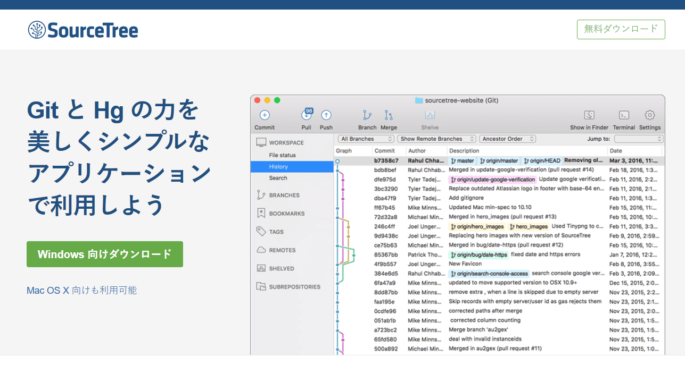

# otameshi
GitHubお試しのリポジトリ．

GitHubの使い方になれるためのリポジトリです．
好きなようにいじってもらって構いません．

##GitHubとGitの違い
Gitはバージョン管理のプログラム．
GitHubはそれを管理したりなんだりできるウェブサービス．

Gitが動画ファイルでGitHubがYoutubeみたいな感じ？

##Gitについて
GitHubをつかうにはGitが使えなければならない．
Gitの使い方は[こちら](https://git-scm.com/book/ja/v2)でダウンロードできる電子書籍を読めば理解できるはず．

##SourceTree

SourceTreeはGitをGUIで扱うアプリケーション．
ダウンロードは[公式ページ](https://ja.atlassian.com/software/sourcetree)からしてください．

これを使えばGitについてよく分かっていなくても，割りとなんとかなるかも．

##使い方
###GitHubアカウントの作成
GitHubをアカウントも作成してください．
GitHubのアカウントを作成したらSlackの方でアカウント名を教えて下さい．
リポジトリへの書き込み権を付与します．
GitHubでは自分の作成したリポジトリ以外にはデフォルトでは書き込みできません．
リポジトリの管理者が書き込みの許可を与える必要があるようです．

###SourceTreeのインストール
SourceTreeのインストールをしてください．
途中でAtlassianのアカウントを作る必要があるかもしれません．
インストールは[このページ](http://nelog.jp/sourcetree)あたりでも参考にしてください．
GitHubのアカウントを登録しておくといいのかもしれません．
ここで登録しなくてもなんとかなるようですが．

なにかうまくいかないことがあったらSlack上で質問してくれれば誰かに手助けしてもらえるかもしれません．

クローンする．

作業をする前にブランチを作る
->ブランチは歴史の分岐
->分岐を作ってその中で作業して，作業が終わったらその分岐を合成する
->コンフリクトしにくくするため
->masterブランチは全員の出来上がったプログラムが置かれている状況にする
  ->基本的にはmasterブランチと自分の作業用ブランチを追っていればOK

->ブランチを作ったらそのブランチ内で作業する．
  ->作業の内容を登録するためにまずaddする．
    ->addしたものがコミットしたときに保存される．
  ->コミットを行う
    ->コミットメッセージは何か書かねばならない
  ->プッシュする
    ->プッシュすることでGitHub上に自分の変更が登録された
    ->プッシュする際にはGitHubのアカウント名とパスワードが必要かもしれません
    ->パスワード認証ではなくssh認証にすることもできるようです
      ->セキュリティが気になる人はsshにしておくといいかもしれません

一度pushしたら，プルリクエストを行う．
->プルリクエストとはGitHubの機能で自分の変更を取り込んでくれとリクエストするもの
->二種類ある
  ->フォークしてプルリクエストするもの
    ->こちらはオープンソースプロジェクトとか大規模な物で行われる
  ->同一のリポジトリ内でブランチを合成してほしいとリクエストするもの
    ->今回はこちらの機能を使う
->自分のブランチをmasterに取り込んでもらう様にプルリクを出す
->取り込んでもらえるような完成した状態でなくてもとりあえずプルリクを出す
->プルリクエストをとりあえず出しておいてそれから作業を続ける
  ->作業中であることを示すためにプルリクエストのタイトルに[wip]をつける
    ->work in progress
  ->作業をしたらaddしてcommitしてpushする．
  ->プルリクエストのページではみんながコメントをつけたりとかできる
    ->周りのメンバーが作業の様子を知ることができる
    ->作業中の段階から周りにコメントを貰うことができるので，作業中の段階からプルリクを出す．
  ->作業が終わったら[wip]を外す
->[wip]が外れたブランチはマージする
  ->マージできないときはmasterがブランチを切ったときより進んでいる場合
    ->masterを取り込んで，再度マージをする
    ->基本的にみんなバラバラのファイルを扱っていて，複数人で同じファイルを編集することはないだろうから，このような事態になることは少ないかもしれない．

GitHub上と自分のローカルを一致させるために適宜プルすること．

以上で他の人の作ったプログラムのソースコードをメンバー間で共有することができ，他のメンバーの作業状況も知ることができるようになる．
