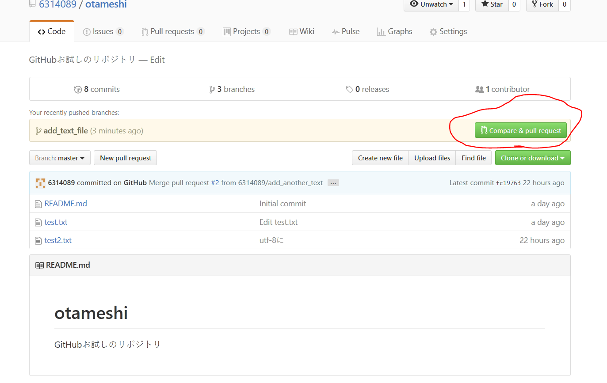

# otameshi
GitHubお試しのリポジトリ．

GitHubの使い方になれるためのリポジトリです．
好きなようにいじってもらって構いません．

##GitHubとGitの違い
Gitはバージョン管理のプログラム．
GitHubはそれを管理したりなんだりできるウェブサービス．

Gitが動画ファイルでGitHubがYoutubeみたいな感じ？

##Gitについて
GitHubをつかうにはGitが使えなければならない．
Gitの使い方は[こちら](https://git-scm.com/book/ja/v2)でダウンロードできる電子書籍を読めば理解できるはず．

##SourceTree

SourceTreeはGitをGUIで扱うアプリケーション．
ダウンロードは[公式ページ](https://ja.atlassian.com/software/sourcetree)からしてください．

これを使えばGitについてよく分かっていなくても，割りとなんとかなるかも．

##使い方
なにかうまくいかないことや分からないことがあったらSlack上で質問してくれれば誰かに手助けしてもらえるかもしれません．

###GitHubアカウントの作成
GitHubをアカウントも作成してください．
GitHubのアカウントを作成したらSlackの方でアカウント名を教えて下さい．
リポジトリへの書き込み権を付与します．
GitHubでは自分の作成したリポジトリ以外にはデフォルトでは書き込みできません．
リポジトリの管理者が書き込みの許可を与える必要があるようです．

###SourceTreeのインストール
SourceTreeのインストールをしてください．
途中でAtlassianのアカウントを作る必要があるかもしれません．
インストールは以下のページあたりでも参考にしてください．
- [Gitを視覚的に操作できる「SourceTree」のインストール方法 ](http://nelog.jp/sourcetree)
- [SourceTree for Mac インストールから初期設定の手順](http://glatchdesign.com/blog/web/tools/770)

GitHubのアカウントを登録しておくといいのかもしれません．
ここで登録しなくてもなんとかなるようですが．

###クローンする
作業をするためにGitHub上にあるものをコピーしてくる（クローンする）必要があります．以下でSourceTreeでのクローンの手順を説明します．

「新規/クローンを作成する」をクリックします．

クローン元のパスにクローンしたいGitHub上のリポジトリのurlを貼り付けます．
保存先のパスにはローカルの作業用のパスを設定してください．
最後にクローンをクリックします．

クローンが完了しました．

指定したローカルの場所にクローンされたものが配置されています．
このフォルダの中で作業を進めていきます．

###作業用ブランチを作成する
作業をはじめる前にブランチを作成します．

ブランチというのは歴史の分岐みたいな感じです．詳しくはGitについて各自調べてください．きちんと理解していなくても使っていくうちに分かるような気もします．

各自が作業をする前にそれぞれブランチを切って，その中で作業を行い，作業が完了してからその分岐を本流に合流させるという形で作業を進めていきます．このようにして進めることで，基本的に自分の作業用のブランチには他人の作業は混ざり込まなくなるので複数人で作業をしても混乱しにくくなります．

本流であるデフォルトのmasterブランチは全員の出来上がったプログラムが置かれている状況にします．作業が一段落した段階でmasterに合流させるようにすることで，このmasterブランチには基本的に作業途中の中途半端なのが混ざることがないようにします．

これで基本的にはmasterブランチと自分の作業用ブランチを追っていればOKな状況になります．

以下にSourceTreeでブランチを作成する手順を説明します．

まずはブランチをクリックします．

次に作りたい作業用ブランチの名前を入力してブランチを作成を押します．ブランチ名は他人とかぶらないようなものにした方がいいかもしれません．自分のアカウント名などを入れておくと被らなくていいかもしれません．ここでは単純なブランチ名を使っています．

これで新しいブランチが作成されました．masterブランチから新しい作業用ブランチに移動した状態になっています．ブランチ名の左に二重丸がついているものが現在のブランチです．

###最初のコミットを行う
作業用ブランチを作成したら，その中で作業を行っていきます．

ローカルのクローンしてきたフォルダの中で作業を行っていきます．
ここではテキストファイルを一つ追加してみます．

GitHubのリポジトリはパブリックなので誰からでも見れるような状況になっています．著作権などに気をつけてあまり不適当なファイルは置かないように．

作業をすすめると，SourceTree上では「コミットされていない変更があります」と表示されます．
これから今加えた変更をコミットしていきます．

コミットとはGitにファイルを登録して変更履歴を記録することです．
保存したいものはとりあえずコミットすればOKです．

SourceTree上で「コミットされていない変更があります」の部分をクリックすると，「作業ツリーのファイル」という部分に先程作成したファイルが表示されています．

これを選んで「Stage Selected」をクリックしてください．

hoge.txtがindexにステージしたファイルとなりました．
このindexにステージされたものが，コミットすることでGitに保存されます．Gitに保存したい場合は，保存したいファイルをindexにステージしてからコミットをする，と言った手順を取ることになります．

Gitで保存管理したいファイルをステージしたら，コミットをクリックしましょう．

コミットメッセージを追加してコミットをクリックすることでコミットが完了します．
コミットにはコミットメッセージが必須です．このコミットメッセージは後で見直すこともあるのでそれっぽいことを書いておきましょう．特に最初の一行が表示されることが多いので，一行で何をやったのかを適当にまとめておけばOKです．

これでコミットが完了し歴史が進んだことが確認できると思います．

まだコミットが完了したのは自分のローカルの中だけです．
GitHubの方にこのコミットを反映してやる必要があります．
そのためにはプッシュを行います．プッシュをクリックしてください．

プッシュするブランチを選びます．今作った作業用のブランチを選択してプッシュをクリックします．

初めてプッシュするときはGitHubのアカウントのユーザー名とパスワードを聞かれるかもしれません．きちんと入力をすればpushが完了するはずです．pushができないときはユーザー名やパスワードが間違っていないか確認しましょう．設定の中から確認変更ができるはずです．
リポジトリの変更権限がないという場合もあるかもしれません．そのときはSlack上でGitHubのアカウント名を教えて下さい．このリポジトリの変更権限をそのアカウントに与えます．

パスワード認証だけでなくsshでの接続もできるようです．
セキュリティ的に気になる人はsshにしておくといいかもしれません．
sshにしたい人は自分で調べてなんとかしてください．

ここまでの作業を終えたらブラウザでGitHubを眺めてみましょう．
自分の作ったブランチがGitHubの方に追加されているはずです．
このブランチを選択すると，自分の追加したファイルが存在すると思われます．

###プルリクエストをする
一度pushをしたら直ぐにPull Request（プルリクエスト，プルリク，PRとも）を行います．

####プルリクエストとは
プルリクエストとはGitHubの機能で，自分の変更を取り込んでくれとリクエストするものです．

プルリクエストには二種類あります．

一つはリポジトリをフォークしてから行うものです．
これはオープンソースプロジェクトみたいな，誰がプログラムを書くかわからないようなときとかそう言うので使われているようです．
今回はこちらは利用しません．

もう一方は，同一のリポジトリ内でブランチを合成してほしいとリクエストするものです．
先程作業用のブランチを作ったので，これをmasterに合流させてほしいとリクエストを出すことになります．
今回はこちらの機能を利用していきます．

####プルリクエストを出すタイミングとなぜプルリクエストを出すのか
取り込んでもらえるような完成した状態でなくても，ブランチを作成したらとりあえずPRをだしましょう．
PRでは，他のメンバーが作業過程を見たりコメントしたりすることができるようになるので，そちらの機能を使うためにも作業用ブランチを作ったらすぐにPRを出してしまいます．
PRを出さなくても作業用ブランチをmasterに合流させることはできますが，PRを出しておくことでGitHub上で他のメンバーに何をやっているのかを見てもらえるようになるので，PRを使っていきましょう．

####PRの出し方
GitHub上で現在のブランチがmasterであることを確認して，New pull requestボタンを押しましょう．

その次の画面では自分の作業用ブランチを選択します．
「この選択したブランチをmasterに合流してほしい」というリクエストを出すことになります．

次にPRの名前と説明を追加します．

先程の作業用ブランチをPRを出すことになるわけですが，作業中のブランチなのでまだmasterに取り込んでほしくはないです．
そこで名前の先頭にはwip（work in progress）とつけて，まだ作業中であることを示しておきましょう．
wipがついていないブランチは，作業が完了しているものとしてmasterにマージしていきます．
作業が終了した段階でこのwipを外すことになります．

名前と説明を追加し終えたら，Create pull requestボタンを押しましょう．

自分で作成したり変更加えたりした直後のブランチならば，GitHubの上の方に表示されていることが有ります．こちらを利用したほうがお手軽にPRを作れるので，下のように表示されているときは，赤丸で囲ってあるボタンを押しましょう．

Create pull requestボタンを押すとPRが作成されます．
作成されたPRは以下のような画面になっています．

###作業をすすめる
PRを作成し終わったら実際に作業を進めていきましょう．
先ほど作成したテキストファイルに適当な文字を書いて保存してみます．

上書き保存を行うと，SourceTreeの方で「コミットされていない変更があります」と表示されます．またコミットを行いましょう．

自分が作業用のブランチにいることを確認して，編集したファイルをステージングしてコミットボタンを押します．

コミットメッセージを書いてコミットを完了させましょう．

コミットを終えると，GitHub上にあるものよりも自分のローカルにあるものが一つだけコミットが進んだ状態になります．自分のローカルの変更をGitHubの方に反映させるためにpushをしましょう．

プッシュを終えるとPRの画面の方にコミットが追加されます．
wipでPRを作っておけば，他の人がPR一覧からPRのページに飛ぶことで，その作業の様子をGitHub上で確認できるようになります．

コミットは1つずつプッシュする必要はありません．いくつかまとめてプッシュをすることもできます．
こまめにプッシュをしたほうがGitHub上で表示される作業履歴と実際の作業履歴の差が少なくはなりますが．

個別のPRの画面ではコメントを追加することができます．
他人の作業についてコメントを残したい場合とかに使っていきましょう．
議論が長くなる場合はSlackの方でやってもいいかもしれませんが．

コミットをクリックすることで，各コミットの個別のページに移動できます．

この画面では，ソースコードの行を指定して，その行に対してコメントをつけることができます．

コメント追加の横の隣のレビューというボタンはレビュー機能みたいです．
レビューを受けるまでマージできないようにするとかそういった機能のようです．詳しくは[こちら](http://qiita.com/terra_yucco/items/fa08bd2a4b498963a313)や[こちら](http://qiita.com/edwardkenfox/items/6340715d84f180832978)など．
この機能は使うほどでもないのかなと思っていますが．

行に対してコメントを付けたときのPRページの様子です．

###作業完了したらマージする
作業が完了したらwipを外します．
EditをクリックしPRのタイトルからwipを取り除いて保存しましょう．

本来ならばwipを外した人とマージする人は別人にするべきです．そうすることで作業した人と別の人が確認をしてからマージすることになるので，バグを防いだりできます．が，今回はそこまでする必要もないので，自分の作業用ブランチは自分で処理してしまいましょう．

これからwipを外した作業用ブランチをマージしていきます．
「Merge pull request」ボタンをクリックしましょう．

マージコミットのメッセージを入力して「Confirm merge」をクリックしましょう．

作業用ブランチをmasterに合流させることに成功したので，もう作業用ブランチは必要ありません．PR画面でマージを終えるとご丁寧にブランチ削除のボタンが表示されます．「Delete branch」をクリックしましょう．

ブランチが削除されました．

マージとブランチの削除をGitHub上で行ったので，ローカルの方ではまだブランチの合流も削除もされていない状況になっています．SourceTreeに表示されているローカルの方をGitHubに同期していきましょう．

まずはmasterブランチの方に移ります．「master」をダブルクリックしましょう．

masterブランチに移ったことを確認します．

masterに移ったらプルをします．プルをクリックします．

okを押します．

するとローカルの方でも作業用ブランチがmasterにマージされた状況になります．

次にフェッチも行います．フェッチをするとGitHub上の他の人のブランチの情報とか，GitHub上で削除したブランチの情報を持ってくることができます．

これでGitHubの作業用ブランチが削除されたことがローカルの方に反映されたので，「origin/add_text_file」ブランチは消えています．
最後にローカル専用のoriginのついていない「add_text_file」を削除します．

masterブランチにいることを確認して，「add_text_file」の上で右クリックして「add_text_fileを削除」を選びます．
これで一通りマージが完了しました．

プルとフェッチの違いや「origin/add_text_file」と「add_text_file」の違い，そもそも「origin」とは何かなどが気になる人は各自Gitを勉強してください．割とややこしいので別に調べなくても何とかなるかもしれません．

###マージできないとき

  ->マージできないときはmasterがブランチを切ったときより進んでいる場合
    ->masterを取り込んで，再度マージをする
    ->基本的にみんなバラバラのファイルを扱っていて，複数人で同じファイルを編集することはないだろうから，このような事態になることは少ないかもしれない．

GitHub上と自分のローカルを一致させるために適宜プルやフェッチすること．

以上で他の人の作ったプログラムのソースコードをメンバー間で共有することができ，他のメンバーの作業状況も知ることができるようになる．
